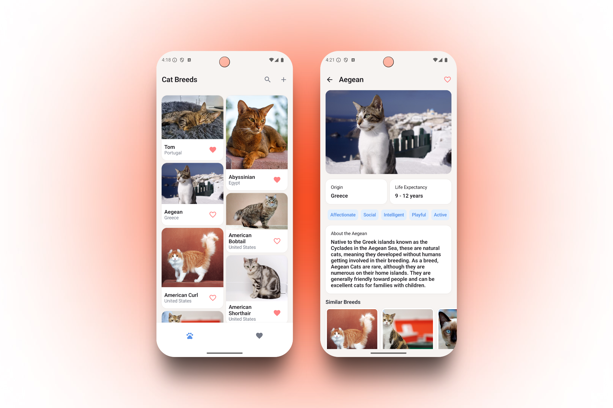

# Cat Breeds - Android App
A modern Android application built with Kotlin that integrates with [The Cat API](https://thecatapi.com/) to showcase cat breeds. This project demonstrates a clean separation of concerns with a multi-module architecture, MVVM pattern, Jetpack Compose UI, offline functionality, unit testing, error handling, and follows Android development best practices.



## Features
- **Browse Cat Breeds**: View a list with images and basic information
- **Search Functionality**: Filter breeds by name
- **Add New Breeds**: Create custom breeds, wi
- **Favorites Management**: Mark/unmark breeds as favorites
- **Detailed View**: Visit a breed page to check further details
- **Offline support**: Access previously loaded data without an internet connection

## Technical Stack
- **Architecture**: Modularization (Core, Data, Domain, Features)
- **Kotlin**: Primary programming language
- **Jetpack Compose**: UI toolkit
- **Jetpack Navigation**: Navigation between screens
- **Room Database**: Local data persistence
- **Retrofit**: Network requests
- **Coroutines & Flow**: Asynchronous programming
- **Coil**: Image handling
- **Dagger Hilt**: Dependency Injection

### Other Libraries
- **MockK**: Unit testing
- **Google Gson**: JSON serialization/deserialization

## Project Structure

The project follows a modular architecture to maintain separation of concerns and scalability

```
├── app/                    # Application entry point and DI setup
├── core/                   # Common resources, UI components, theme, and utilities
├── data/                   # Data layer (API, Room DB, Repository Implementations)
├── domain/                 # Domain layer (Models, Repository Interfaces)
├── features/               # Feature-specific modules
│   ├── breed_list/         # Main screen: List, Search and NewBreed form
│   ├── breed_detail/       # Detail screen for breeds
│   └── favorite_list/      # Screen for managing favorites
└── test_core/              # Shared test utilities and mocks
```

## Setup

1. Clone the repository
2. Open the project in Android Studio
3. Add your Cat API key to `local.properties`:
   ```
   API_KEY="your_cat_api_key_here"
   ```
4. Build and run the application